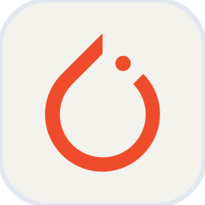
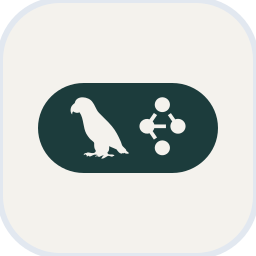
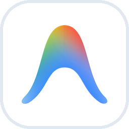
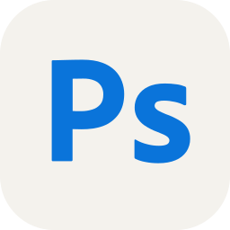

  <h1>🟩 Hi there, I'm NamGreen 🟩</h1>

   

  <!-- Avatar bo tròn -->
  

  ### 🚀 AI Engineer / Software Developer

  

    
    
    
    
  

  <!-- Auto-typing SVG animation -->
  

---

### 👨‍💻 About Me
- 🔭 I’m currently working as an **AI Engineer Intern**
- 🎓 I’m a final-year student at **Hanoi University of Industry (HaUI)**
- 🌱 Focusing on **Deep Learning, LLMs, AI Agents & Unity (C#)**
- 👯 Looking to collaborate on **AI-driven applications, Open Source & Interactive Tech**
- 💬 Ask me about **Python, Machine Learning, Agentic Workflows & 3D / Game Dev**
- ⚡ Fun fact: **I turn coffee into code and craft virtual worlds ☕🎮**

---

### 🛠 Skills & Tech Stack

  <!-- Core Skills -->
  
   
  <!-- AI / LLM & Creative 3D Tools (Matching Skillicons Light Theme #F4F2ED) -->
  
  
  
  
  
  
  
  
  
  
  

---

### 📊 GitHub Stats

  
  

  

---

  <!-- Profile visitor counter -->
  

